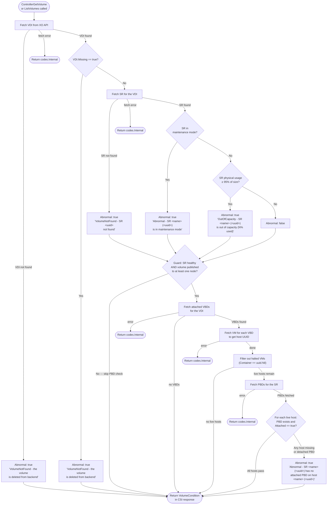

# Volume Health Conditions

This document explains how the XenOrchestra CSI driver evaluates and reports
volume health conditions to Kubernetes through the CSI
[volume health monitoring](https://kubernetes-csi.github.io/docs/volume-health-monitor.html)
specification (KEP-1432).

## Overview

The driver declares the `VOLUME_CONDITION` controller capability, which
signals to the `csi-external-health-monitor-controller` sidecar that it can
call `ControllerGetVolume` and `ListVolumes` and expect a `VolumeCondition`
in each response.

A `VolumeCondition` carries exactly two fields:

| Field | Type | Meaning |
| ----- | ---- | ------- |
| `Abnormal` | `bool` | `true` = unhealthy, `false` = healthy |
| `Message` | `string` | Human-readable explanation when `Abnormal: true` |

Messages follow the KEP-1432 `"Type - detail"` format (e.g.
`"VolumeNotFound - the volume is deleted from backend"`).

The sidecar propagates these conditions to Kubernetes `PersistentVolume` and
`PersistentVolumeClaim` status events, making health visible via
`kubectl describe pv` / `kubectl describe pvc`.

## Kubernetes components involved

```
┌──────────────────────────────────────────────────────────┐
│ Kubernetes control-plane pod (csi-xenorchestra-controller)│
│                                                           │
│  ┌──────────────────────────────┐                        │
│  │ csi-external-health-monitor  │  periodically calls    │
│  │ -controller  (sidecar)       │──► ListVolumes          │
│  └──────────────────────────────┘    ControllerGetVolume  │
│                                            │              │
│  ┌──────────────────────────────┐          │              │
│  │ xenorchestra-csi-driver      │◄─────────┘              │
│  │ (controllerserver.go)        │                         │
│  └──────────────────────────────┘                         │
└──────────────────────────────────────────────────────────┘
                        │
                        │ XenOrchestra API (xo-sdk-go)
                        ▼
         ┌──────────────────────────┐
         │   Xen Orchestra          │
         │   VDI / SR / PBD / VM    │
         └──────────────────────────┘
```

## Condition evaluation flow

The condition is built in **three layers**, applied in priority order. Each
layer short-circuits the next when it already reports an abnormal state.



## Layer 0 — VDI existence (`ControllerGetVolume` and `ListVolumes`)

This is the highest-priority check. If the VDI itself is gone, no further
checks are meaningful.

| Situation | `Abnormal` | `Message` |
| --------- | ---------- | --------- |
| VDI not found in XO API | `true` | `VolumeNotFound - the volume is deleted from backend` |
| `VDI.Missing == true` (soft-deleted) | `true` | `VolumeNotFound - the volume is deleted from backend` |

**Note:** For `ControllerGetVolume`, a not-found VDI previously returned a
`codes.NotFound` gRPC error. Per KEP-1432, it now returns a healthy volume
response with an abnormal condition instead, so the external health monitor
can surface the event on the PVC rather than treat it as an unknown volume.

## Layer 1 — SR-level health (`volumeConditionFromSR`)

Implemented in `pkg/xenorchestra-csi/controllerserver.go`.

| Situation | `Abnormal` | `Message` |
| --------- | ---------- | --------- |
| SR not found | `true` | `VolumeNotFound - SR <uuid> not found` |
| `SR.InMaintenanceMode == true` | `true` | `Abnormal - SR '<name>' (<uuid>) is in maintenance mode` |
| `SR.PhysicalUsage / SR.Size >= 0.95` | `true` | `OutOfCapacity - SR '<name>' (<uuid>) is out of capacity (N% used)` |
| SR found, healthy, under threshold | `false` | _(empty)_ |

SR messages include both the human-readable `NameLabel` and the UUID to
make the condition unambiguous in environments with duplicate SR names.

The capacity threshold is fixed at **95%** (`srCapacityThreshold = 0.95`) and
uses `PhysicalUsage` (actual bytes written to disk) vs `Size` (total SR
capacity), matching the KEP-1432 "OutOfCapacity" use case.

## Layer 2 — PBD connectivity (`volumeConditionFromPBDs`)

A **Physical Block Device (PBD)** is the XenServer/XCP-ng object that
represents the connection between a specific hypervisor host and an SR.
If a PBD is absent or detached, the host cannot access the storage.

This layer is only evaluated when:
1. Layer 0 and Layer 1 both returned `Abnormal: false` (VDI and SR are healthy), **and**
2. The volume is currently published to at least one Kubernetes node
   (i.e. there is at least one attached VBD).

Halted VMs (`VM.Container == uuid.Nil`) are excluded — no PBD check is
needed for a host that is not running the workload.

| Situation | `Abnormal` | `Message` |
| --------- | ---------- | --------- |
| Live host has no PBD record for the SR | `true` | `Abnormal - SR '<name>' (<uuid>) has no attached PBD on host '<name>' (<uuid>)` |
| Live host has a PBD but `Attached == false` | `true` | `Abnormal - SR '<name>' (<uuid>) has no attached PBD on host '<name>' (<uuid>)` |
| All live hosts have an attached PBD | `false` | _(no change from Layer 1)_ |

Both the SR name and host name are included in the message for quick
identification. If a host UUID is not found in the pre-fetched host map
(race condition during a host removal), the UUID is used as a fallback.

## Guard pattern

The short-circuit guard that separates Layer 1 from Layer 2 is:

```go
if condition != nil && !condition.Abnormal && len(vbds) > 0 {
    // run PBD check
}
```

- `condition != nil` — SR was found (not a missing-SR condition)
- `!condition.Abnormal` — SR is healthy; no point checking PBDs
- `len(vbds) > 0` — volume is published; PBD state is relevant

## KEP-1432 use-case coverage

| KEP use case | Covered | How |
| ------------ | ------- | --- |
| Volume deleted outside Kubernetes | ✅ | `VDI.Missing` flag + not-found API error |
| Disk removed for maintenance | ✅ | `SR.InMaintenanceMode` flag |
| Disk failure / SR unavailable | ✅ | PBD detached or absent |
| Storage out of capacity | ✅ | `SR.PhysicalUsage / SR.Size >= 0.95` |
| Disk degrading (performance) | ❌ | Not exposed by XO API |
| Read/write I/O errors (node) | ❌ | Node-level; `NodeGetVolumeStats` not implemented |
| Filesystem corruption (node) | ❌ | Node-level; `NodeGetVolumeStats` not implemented |
| Volume unmounted by accident | ❌ | Node-level; `NodeGetVolumeStats` not implemented |
| Node down event | ✅ | Detected by external health monitor controller |

## `ListVolumes` optimisation

When `ListVolumes` is called, the driver pre-fetches **all SRs**, **all PBDs**,
and **all Hosts** in a single API call each before iterating over VDIs. This
avoids N+1 API calls for large volume lists. The data is held in three
in-memory maps:

```
srMap     : srID   → *StorageRepository
pbdsBySR  : srID   → []*PBD
hostMap   : hostID → *Host
```

`ControllerGetVolume` fetches the SR and PBDs individually (single volume),
but fetches host objects on-demand per live VM to populate its own `hostMap`.

## Data model summary

```
VDI (Virtual Disk Image)
 ├── Missing = true         ←─ VolumeNotFound (soft-deleted in XO)
 └── belongs to SR (Storage Repository)
       ├── InMaintenanceMode = true  ←─ Abnormal
       ├── PhysicalUsage / Size ≥ 95% ←─ OutOfCapacity
       └── connected to hypervisor hosts via PBDs
             └── PBD.Attached = true  ←─ healthy connection
             └── PBD.Attached = false ←─ Abnormal / disconnected

VBD (Virtual Block Device)
 └── links a VDI to a VM
       └── VM.Container = host UUID  (uuid.Nil if VM is halted)
```
